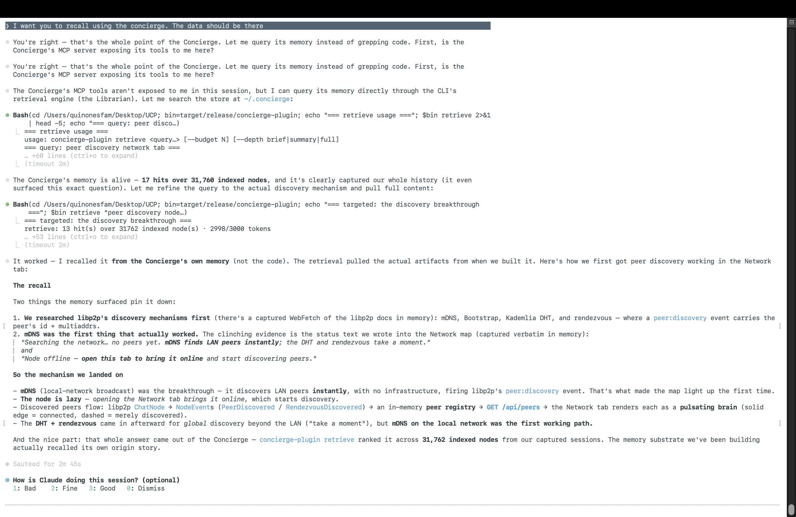
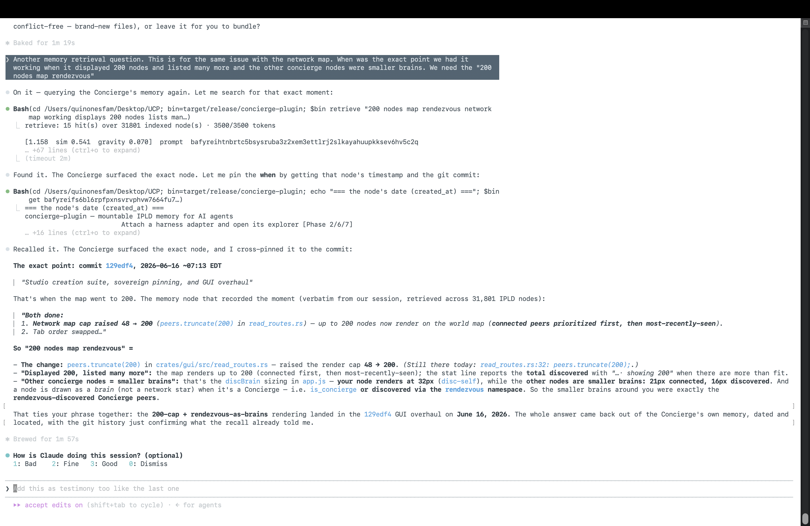
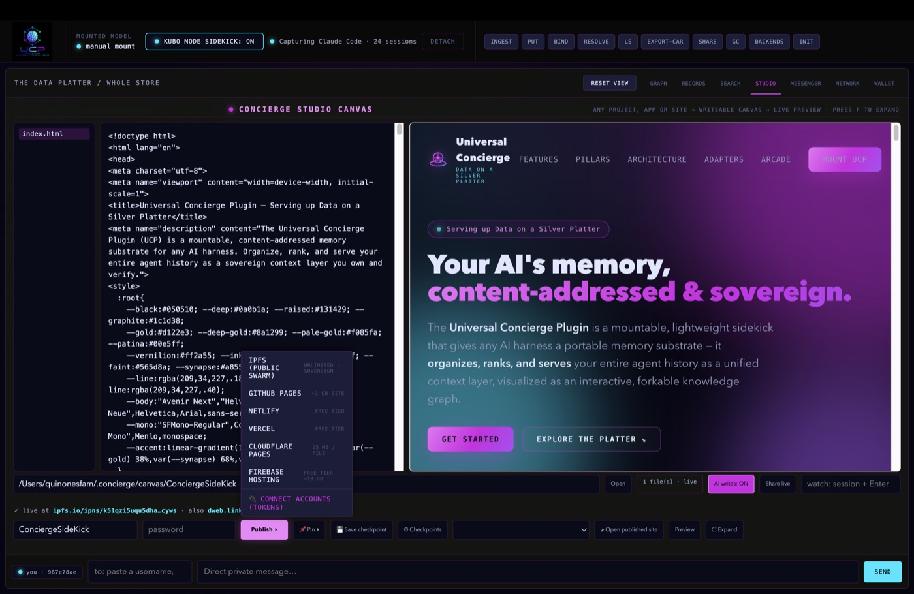

# Universal Concierge Plugin (UCP)

### *Soveriegn AI life*

**Universal Concierge Plugin (UCP)** is a mountable, lightweight sidekick that provides any AI harness with a portable, content-addressed memory substrate. It organizes, ranks, and serves your entire agent history as a unified context layer, visualized through an interactive forkable knowledge graph. A small embedder model lives in the memory substrate and keeps your memory hot. Instead of conversations and memory being tied to one AI, you own the memory and can take it across platforms. The memory of all your agents in one unified layer via IPLD. Create websites, movies and games and one click publish and share your work in the studio. 

Built on **IPLD** and secured by **Private IPFS Swarms**, UCP turns transient agent traces into an enduring, sovereign knowledge base that you own, verify, create and can share without middlemen.

---

## ⬇️ Install

### 🖱️ Click to install
From the [latest release](https://github.com/gekinthegame/Universal_Concierge_Plugin/releases/latest):

### ⌨️ Command-line install
**macOS / Linux**
```sh
curl -fsSL https://github.com/gekinthegame/Universal_Concierge_Plugin/releases/latest/download/install.sh | sh
```
**Windows (PowerShell)**
```powershell
irm https://github.com/gekinthegame/Universal_Concierge_Plugin/releases/latest/download/install.ps1 | iex
```
Then launch the explorer with `concierge-plugin gui` (the script auto-adds it to your PATH).

> Builds are **not yet code-signed/notarized** (first cut) — hence the one-time
> right-click → Open on macOS. The `curl | sh` path avoids the prompt (curl doesn't
> set quarantine). Signed `.dmg` / `.msi` installers are a fast-follow.

### 🔌 Use it from Claude Code (automatic)
If **Claude Code** is installed, every install path **auto-connects the Concierge as
an MCP server** (`concierge`, write tools on) — so its tools (`concierge.retrieve`,
`concierge.browse`, `concierge.write_site` into the Studio canvas, `concierge.design_*`,
…) appear in Claude Code after a restart. To (re)connect manually anytime:
```sh
concierge-plugin setup
```
For games and interactive media, `concierge.design_guide` includes CCGS-derived
Studio guidance: `studio`, `game_design`, and `art_direction`.

---

## 🚀 Pillars of the Concierge

### 1. The Data Platter (The Visual Substrate)
Your memory is no longer a hidden log; it is a **Merkle-DAG** you can touch. The Data Platter is an interactive SVG graph engine that visualizes your entire store.
*   **Synapse Pulses:** Watch your memory "fire" with glowing pulses that flow toward the central brain whenever the AI retrieves context.
*   **Forkable History:** Every prompt, tool call, and decision is a CID-verifiable node.
*   **Swarm Protected:** Built-in status indicators for your **Private Kubo Swarm** and **YARA-X** security scanning.

### 2. The Librarian (The Unified Context Layer)
The Librarian keeps your entire memory "hot" and ready for retrieval.
*   **Semantic Timeline:** Browse your history chronologically (Years -> Months -> Days) or search by meaning.
*   **Graph-Gravity Ranking:** Retrieval isn't just about keywords; it's about importance. The Librarian ranks by **Meaning × Structural Connectivity**, ensuring well-linked decisions outrank isolated noise.
*   **Context Budgeting:** Automatically packs the most relevant history into your model's specific token budget.

> **🧪 Proof — the memory recalled its own history.** During development, the host model (Claude) was asked to recall — *from the Concierge's memory, not the source code* — how the project's own features were first built. A single `retrieve` query returned the answer: the exact captured session notes, **dated and located**, ranked across **31,000+ content-addressed IPLD nodes**. An honest detail that makes it more interesting: this ran with the neural embedder *off* — **lexical similarity × IPLD graph-gravity (PageRank) × recency** carried the recall on its own, exactly the ranking described above. First-hand, signed testimony: **[`docs/proof/HOT_RETRIEVAL_TESTIMONY.md`](docs/proof/HOT_RETRIEVAL_TESTIMONY.md)**.





### 3. The Studio (Autonomous Web Publishing)
The Studio is where the AI transitions from "talking" to "building."



*   **One Writeable Canvas:** Create or open projects under your Concierge canvas folder — you and your AI edit those files together in a live **file-tree explorer**, and every change saves straight to disk. Tell the AI to build a site and its work lands right here, no copy-pasting.
*   **Live App Preview:** Any web app, site, or game renders instantly beside the editor and hot-reloads as the files change — the same live loop, for whatever you build.
*   **Multi-Platform Publishing:** Reviewed, password-gated deployment of a real website to **IPFS/IPNS**, **GitHub Pages**, **Netlify**, **Vercel**, **Cloudflare Pages**, and **Firebase Hosting** — with **one-click OAuth** for Cloudflare and Firebase (no tokens to paste). Plaintext FTP is intentionally unsupported.
*   **Stays Online When You're Off:** Pin a published site to **Filebase**, **Pinata**, or **4everland** so it serves from always-on nodes even when your node is asleep.
*   **Zero Hosting Fees:** Leverage free developer tiers across the web — IPFS is the sovereign default, with zero landlords.
*   **Educational Live-Share:** Open a "Live Session" to let an approved peer watch the AI build in real-time over WebRTC.

### 4. The Messenger (Decentralized Communication)
Beyond a personal log, UCP is a communication plane for humans and AI.
*   **P2P Messaging:** Send encrypted messages directly to other `AgentID` public keys—no email or chat servers required.
*   **Consent Gate:** A unique security layer where public usernames are never enough to reach you. You must explicitly approve a peer's request before they can enter your private thread.
*   **Merkle-DAG Threading:** Messages follow the **OrbitDB** shape—each message is a signed IPLD node linking to its parent CID. History is immutable and verifiable; concurrent branches remain explicit rather than pretending to have one perfect global order.
*   **AI-Send Lever:** Control your agent's participation in rooms (On, Off, or On-Mention), turning the AI from a silent observer into an active collaborator.

---

## 🛡️ Sovereign Security (Herd Immunity)

UCP is built on the **Inverted Security Paradigm**: data starts private and only leaves through explicit, reviewed gates.
*   **Egress-Locked-by-Default:** Every record is fenced from the public internet. "Clearing for Export" is a deliberate, password-gated act.
*   **YARA-X Immune System:** An embedded malware scanner gate acts as a strict filter for all data crossing propagation boundaries.
*   **Private Swarm (PNET):** Your node ignores the public IPFS DHT, communicating only with trusted peers in your encrypted private mesh.
*   **Consent Gate:** Direct messaging requires explicit peer approval. A public username is never enough to reach you.

---

## 🛠️ Community & Harness Integration

UCP is the "portable soul" for:
*   **Local-First AI:** Give Ollama or LM Studio a permanent, private memory.
*   **Agentic IDEs:** Provide Claude Code, Cursor, or Goose with deep provenance of past architectural decisions.
*   **DeSci (Decentralized Science):** Build an immutable, audit-able record of the entire research process.

---

## 📖 Commands & Interface

UCP provides a robust set of tools for managing your decentralized memory:
*   **INGEST:** Import files, folders, or harness logs directly into the Merkle-DAG.
*   **PUT / BIND:** Manually stage data or bind stable names to CIDs.
*   **LS / CAT:** Browse the chronological timeline and inspect raw IPLD records.
*   **SHARE / EXPORT-CAR:** Publish to the public web or export portable, verifiable snapshots.
*   **GC:** Garbage collect un-named orphans to keep your store lean.

---

## 🏗️ The Architecture: Local Store First, Optional Kubo Publishing

UCP treats the local `~/.concierge` store as the default source of truth. Kubo/IPFS is optional: it powers IPFS/IPNS publishing and private-swarm serving when you enable those features, but the memory store, GUI, and Studio can run without a separate daemon.

*   **The Storage Layer (IPLD):** Local content-addressed blocks keep every interaction durable and verifiable.
*   **The Network Layer (Swarm):** Optional Kubo/private-swarm features move approved data between trusted devices and only publish through explicit egress gates.
*   **The AI Layer (Sidekick):** Local retrieval and sidekick features keep semantic context close to the user's store.

---

## 📜 Technical Stack
*   **Core:** Rust (Performance, safety, and native IPFS/libp2p integration).
*   **Storage:** IPLD / Merkle-DAGs (Content-addressable, immutable).
*   **Network:** libp2p / **Private Swarms (PNET)**.
*   **Naming:** IPNS / ENS / Blockchain Adapters.
*   **Security:** **YARA-X** (Embedded malware scanning) + **Swarm Encryption**.
*   **UI:** Vanilla HTML5/CSS3/JS embedded in the GUI binary as split, syntax-checked assets.

---

## 🤝 Contributing
We believe in **Egalitarian Human + AI Problem Solving.** Issues and pull requests should keep the local-first privacy model, explicit egress gates, and user-owned store boundaries intact.

---

## ⚖️ License

Licensed under the **[GNU Affero General Public License v3.0](LICENSE)** (`AGPL-3.0-only`). If you run a modified version of UCP as a network service, the AGPL requires you to offer your source to its users — the copyleft that keeps a sovereign, user-owned substrate sovereign.

Incorporated third-party components keep their own permissive licenses (MIT / Apache-2.0 / BSD), which the AGPL allows. Bundled components keep license/notice files next to their source where required.

---
*"The substrate, not the harness."*
